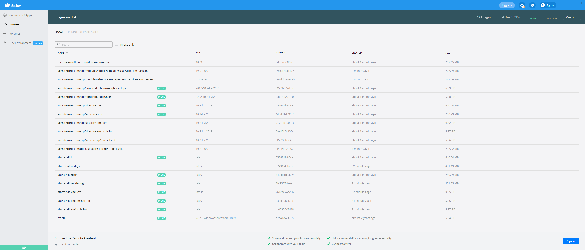
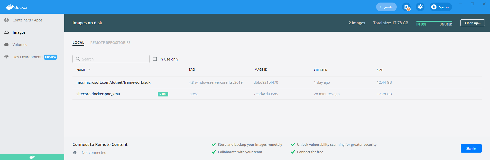

# Overview

This is a proof of concept, consolidating the multitude of Sitecore supported docker containers down to 1. We found using the Sitecore supported docker containers in an XM1 + JSS configuration resulted in a base size of around 17 GB.  A screen shot of a clean docker environment is below:

In the proof of concept, a single image was created. All Sitecore prerequisites were installed into the image. SIF was used to install Sitecore into the container. There are probably areas where the image size could have been brought down a bit, but for a proof of concept the results are probably good enough. We found running an XM1 configuration in a single docker container also resulted in a base size of around 17 GB.

The size of both approaches is very similar. It does not look like there are any space saving advantages here.

Here is a good article that explains how space is consumed and why the Sitecore supported approach takes up the space it does.

https://www.sitecore.com/knowledge-center/getting-started/sitecore-docker-images-repository#chapter4

# Running

1. Place `license.xml` in the `docker\build\xm0\ResourceFiles` folder.
1. Run Docker
    1. Switch to Windows Containers
1. Run `docker-compose up`
